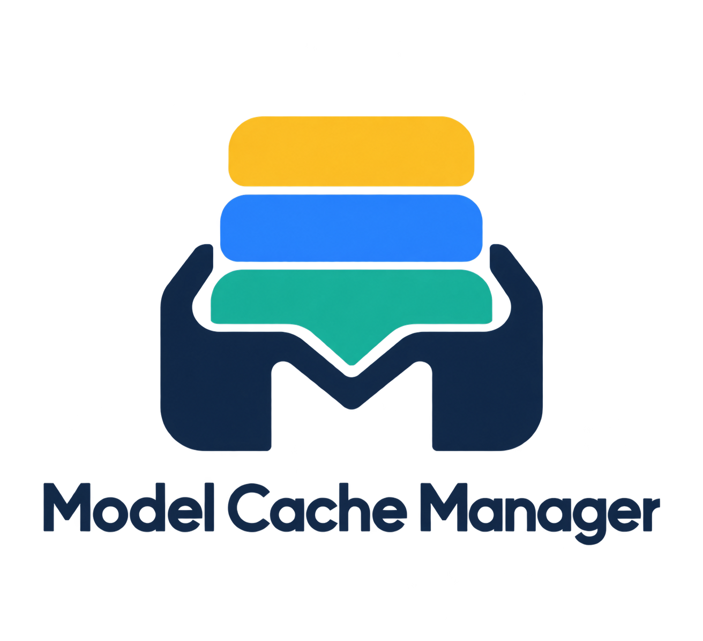
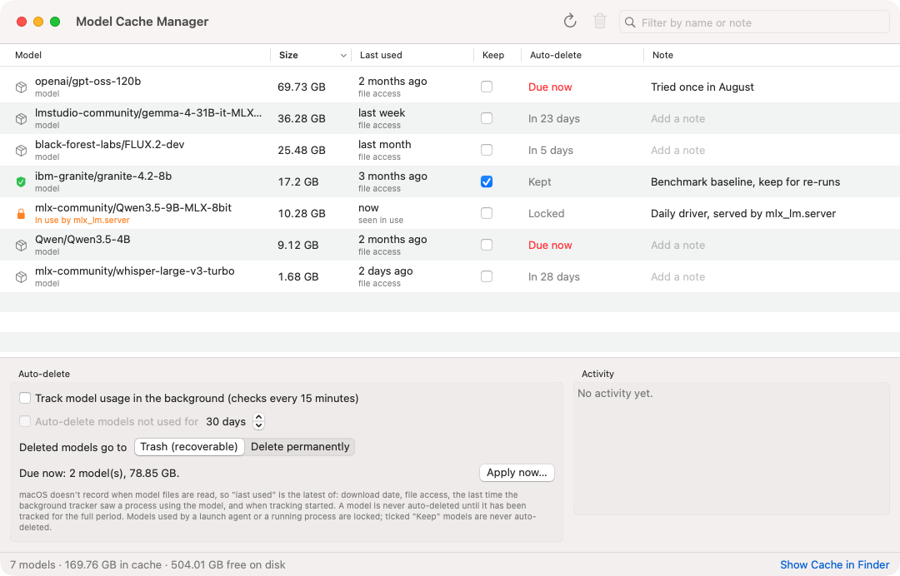
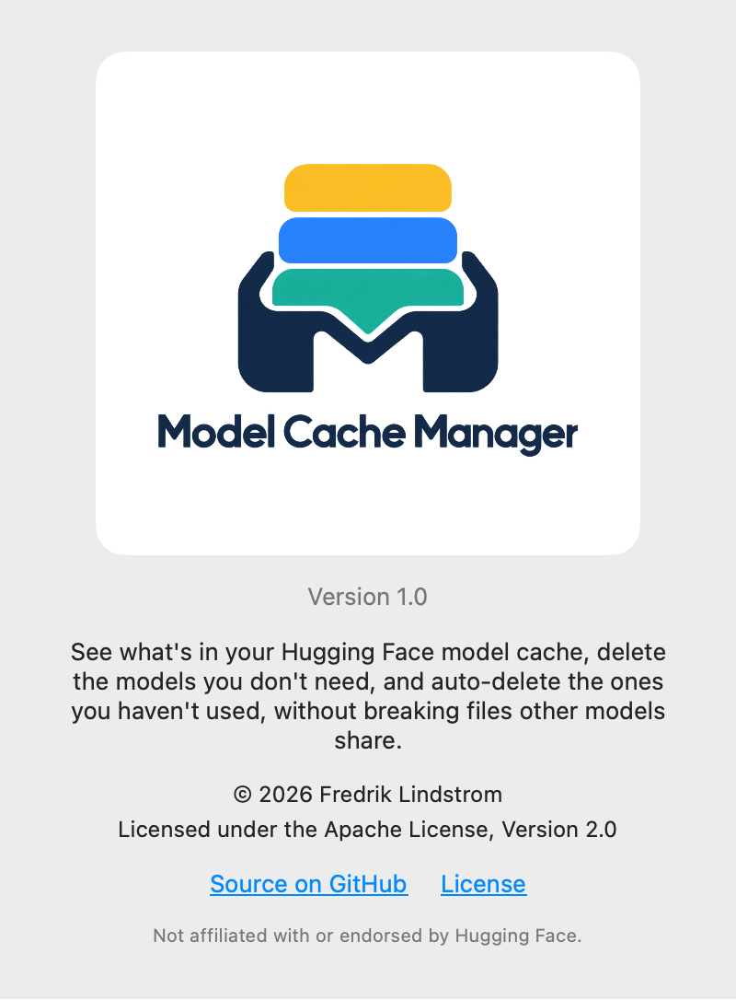

<p align="center"></p>

# Model Cache Manager

A small native macOS app for the Hugging Face model cache. See what's taking up space, delete the models you don't need, and optionally auto-delete the ones you haven't used for a while, without breaking files that other models share.

Works with anything that downloads through `huggingface_hub`: MLX (`mlx-lm`, `mlx-vlm`), Transformers, Diffusers, and the `hf` CLI.



## Features

- **Every cached model in one table**: size, last-used evidence, and status. Sort by size or last use, and filter by name or note.
- **Delete by selection**: click (or ⇧/⌘-click) the models you want gone. By default they go to the Trash as one item per model, so a mistake is recoverable. Permanent delete is an option.
- **Shared-file safe**: the cache keeps weights in a shared, content-addressed `blobs/` store, and model folders only hold links into it. Deleting a model removes the folder *and* the blobs only that model uses. Blobs another model still needs are never touched. The size shown is what deleting actually frees.
- **Keep**: tick it to exclude a model from auto-delete.
- **Notes**: a free-text comment per model ("used by my nightly job", "benchmark only, delete after Friday").
- **Auto-delete**: remove models not used for *N* days (default 30), checked by a lightweight background agent.
- **Locks**: a model is never deleted, by hand or automatically, while a running process names it, holds its files open, or a launch agent or daemon on your Mac refers to it.

## How "last used" works, and why it's careful

macOS doesn't update a file's access time when model weights are read. A model server can load a model every day while the file still shows the date it was downloaded. So a naive "not accessed for 30 days" rule, including the one `hf cache ls` reports, can delete models you use daily.

Model Cache Manager uses the latest of:

1. the download date and any recorded file access,
2. the last time its background agent saw a process using the model (named in the process's arguments, e.g. `mlx_lm.server --model org/name`, or holding its files open).

On top of that:

- **Grace period:** the auto-delete clock never starts earlier than when the app began tracking a model. Nothing is auto-deleted until it has been observed for the full period.
- **Launch agent references:** models named in a LaunchAgent or LaunchDaemon plist are locked, so a server that's stopped right now still keeps its model.

## Install

Requires macOS 14 or later and Xcode (or the Swift toolchain) to build:

```bash
git clone https://github.com/fredriklindstrom/model-cache-manager.git
cd model-cache-manager
./build.sh --install        # builds and copies "Model Cache Manager.app" to ~/Applications
```

The build is signed ad hoc, not notarized. If macOS blocks it the first time, right-click the app and choose **Open**.

## Background tracking and auto-delete

Both are **off** until you switch them on in the app:

- **Track model usage in the background** installs a per-user launch agent (`~/Library/LaunchAgents/io.github.fredriklindstrom.modelcachemanager.agent.plist`). It runs every 15 minutes at background priority, records which models are in use, and applies the auto-delete rule once a day when enabled.
- **Auto-delete** uses the rule above. **Apply now…** shows exactly what would be deleted before doing anything.

Switching tracking off removes the launch agent. Settings, notes and the activity log live in `~/Library/Application Support/ModelCacheManager/`.

## Cache location

Honours `HF_HUB_CACHE`, then `HF_HOME/hub`, then the default `~/.cache/huggingface/hub`.

## Command line

The app binary has a few headless modes:

```bash
APP="$HOME/Applications/Model Cache Manager.app/Contents/MacOS/ModelCacheManager"
"$APP" --list                          # scan and print every model with size, last use and locks
"$APP" --delete model/org/name         # delete one model to the Trash (add --permanent to skip it)
"$APP" --agent                         # run one tracking / auto-delete tick
```

## Rebuilding the icon

`swift scripts/make_icon.swift` crops the mark from `Assets/logo.png` into `Assets/AppIcon-1024.png`. `build.sh` packages the `.icns`.

<p align="center"></p>

## License

Apache License 2.0. See [LICENSE](LICENSE) and [NOTICE](NOTICE).
© 2026 Fredrik Lindstrom.

Not affiliated with or endorsed by Hugging Face.
